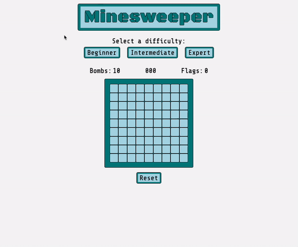

# Minesweeper

As the first solo project of the General Assembly Software Engineering bootcamp I built this Minesweeper game.

[Play the game](https://reddyfede.github.io/Minesweeper/)

## Game Feature and Screenshots

### Features
- Three board sizes for different skil levels.
- First click is always safe, never a bomb.
- Game timer to track playtime.
- Flood mechanic to reveal the board if an empty tile is clicked.
- Right click mechanic to add a flag or question mark to a tile.
- Bombs explosion animation, starting from the clicked bomb.

### Gameplay

### Won game

### Lost game

## Technologies Used

- HTML - CSS - JS
- DOM manipulation

## Future Add-on

- [x] Timer to keep track of the playtime .
- []Scoreboard with prompt asking player name.
- [x] First click always safe
