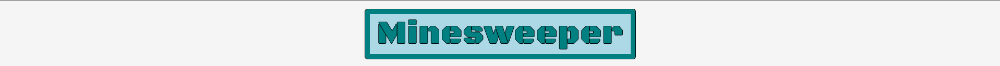
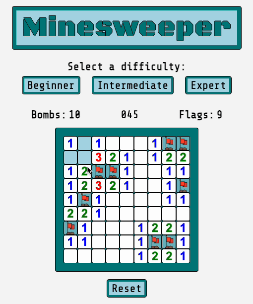

# Minesweeper

As the first solo project of the General Assembly Software Engineering bootcamp I built this Minesweeper game.

[Play the game!](https://reddyfede.github.io/Minesweeper/)

## Rules

The player must reveal all the safe-tiles of the board without clicking the bomb-tiles.

Clicking a safe-tile reveals a hint about the position of the bombs: a revealed safe-bomb tile displays the number of bombs among adjacent tiles.

> Example: A revealed safe-tile displaying the number 2 means that there are 2 bombs among the adjacent tiles. 

Right-clicking a tile can be used by the player to position a flag or a question mark, to help visualize the possible positions of the bombs.

If the player click a bomb-tile the **game is lost.**

If the player manages to reveal all the safe-tiles the **game is won.**

## Game Feature and Screenshots

### Features

- Three board sizes for different skill levels.
  
- First click is always safe, never a bomb.

- Right click mechanic to add a flag or question mark to a tile.  
  
- Flood mechanic to reveal the board if an empty tile is clicked.
  
- Bombs explosion animation, starting from the clicked bomb.
  
- Game timer to track playtime.

### Gameplay Screenshot

### Won Game Screenshot

### Lost Game Screenshot

# Technologies Used

- HTML - CSS - JS
- DOM manipulation

## Future Add-on

- [x] Timer to keep track of the playtime .
- [ ] Scoreboard with prompt asking player name.
- [x] First click always safe.
